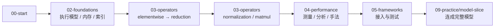

# 学习路径

三条路径，按目标选。它们共用同一份内容，只是进入顺序不同。

## 路径一：系统学（推荐给第一次做算子开发的人）

顺着流程主线走一遍，再按需查。

全程用 [01-workflow](../01-workflow/README.md) 当导航：每进入一个新算子，按流程的九个阶段走一遍。

**阶段检查点**：[验收清单](../99-reference/checklists/stage-gates.md)。

## 路径二：按需查（推荐给已经在做算子的人）

不按顺序，直接进知识域。

| 你的问题 | 去哪 |
|---|---|
| 这个概念什么意思？ | [术语表](../99-reference/glossary.md) |
| 这个算子怎么写？ | [03-operators](../03-operators/README.md) 找对应类别 |
| 为什么慢？ | [04-performance](../04-performance/README.md) |
| 接到一个新算子该从哪下手？ | [决策树](../99-reference/decision-tree.md) |
| 怎么接进框架？ | [05-frameworks](../05-frameworks/op-lifecycle.md) |
| 换平台怎么办？ | [06-platforms](../06-platforms/migration.md) |

## 路径三：以练代学（推荐给时间紧、想先动手的人）

从可判定的练习开始，卡住了再回正文。

~~~powershell
python 09-practice/check.py list
python 09-practice/check.py show VA01
python 09-practice/check.py grade VA01
~~~

顺序建议：

1. [故障注入 12 题](../09-practice/README.md)——先建立“什么算修好了”的标准。
2. [代码阅读 15 题](../09-practice/reading/README.md)——训练读别人的 kernel。
3. [算子五件套](../03-operators/elementwise/vector-add/case-study.md)——走完一个算子的完整交付。
4. [模型切片](../09-practice/model-slice/README.md)——把算子连成模型。

## 不推荐的路径

**按目录编号硬读到底。** 这个仓库的知识域按类型组织，不是按难度。`03-operators/attention` 和 `03-operators/elementwise` 没有先后依赖——按需取用。

**跳过基线和测量直接优化。** 流程图里从阶段 2 到阶段 9 是一条链，跳步的代价在 [流程主线](../01-workflow/README.md) 里逐条写了。
