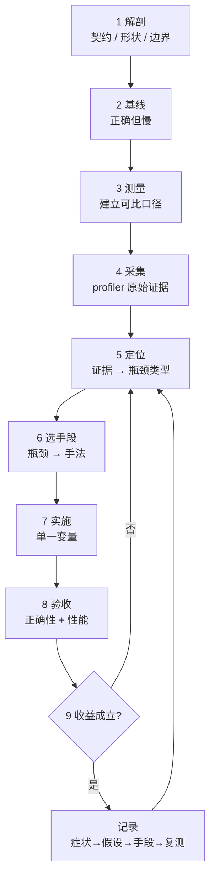

# 算子开发流程主线

知识域页面回答“X 是什么”。它们不回答“我现在卡住了，下一步做什么”。

一个算子从需求到交付，走的是一条固定的路：先有正确版本，再有可信数字，再从证据定位瓶颈，再选手段，最后用新的数字验收。每一步都产出一份**证据**，下一步只依赖上一步的证据。跳过任何一步，后面得到的都只是猜测。

这条主线不复制知识域的内容。每个阶段只讲清三件事：**这一步要产出什么证据**、**什么算合格**、**去哪查具体知识**。

## 全流程



回到阶段 5 是常态，不是失败。“优化一次就结束”不是流程，是运气。

---

## 阶段一 · 解剖：先把契约写死

**产出**：一页契约，写清输入输出的 shape、dtype、布局、广播规则、边界语义、容差口径。

**合格判据**：边界输入列得出来，且每条都能说出期望值。至少覆盖非整除长度、空张量或 size-0 维度、单元素、极值、非连续输入。

**常见误区**：只按“典型输入”写实现。整除长度通过、末项为零的失败就是这样来的。

**去哪查**：`02-foundations/contracts/`（dtype 提升、广播规则、边界语义）、`contracts/determinism`（非确定性来源登记）。

---

## 阶段二 · 基线：正确但慢是必经之路

**产出**：一个语义正确的参考实现，加一组能判定它对错的测试。

**合格判据**：参考实现**故意不求快**。它的职责是提供金标准，后续每个优化版本都和它对拍。期望值必须来自参考实现，不能从优化版本反推。

**常见误区**：先写快版本，再拿快版本的结果当正确性基准。两边一起错，测试全绿。

**去哪查**：各算子目录的 `impl/`（reference）、`05-frameworks/testing`。

---

## 阶段三 · 测量：先建立可比口径

**产出**：一组带完整条件的数字——设备、驱动、编译器与 flags、dtype、layout、shape、线程数、计时范围、样本数与统计量。

**合格判据**：

- 说清**计时范围**：包不包含内存分配、host↔device 拷贝、kernel 启动开销。
- 有 warmup，有多批次采样，报**中位数和区间**，不报单次最小值。
- 输入驻留位置明确：数据本来就在设备上，还是每次从 host 传。

**常见误区**：拿一次运行的单个数字下结论；用不同的计时范围比较两个实现；把 profiler 插桩后的时间当普通运行时间。本仓的模型报告里，单次插桩的 RoPE 占 1130.1 us，比不带 profiler 的整块中位数还高——插桩开销本身就是证据。

**去哪查**：`04-performance/measurement`。

---

## 阶段四 · 采集：拿到原始证据

**产出**：profiler 输出——kernel 时间、访存吞吐、计算吞吐、occupancy、stall 原因，以及实际执行的调用路径。

**合格判据**：

- 保留**原始** trace 和表格，不只看汇总。
- 确认实际走了哪条路径。函数名里出现 flash 不代表跑了硬件 FlashAttention——本仓模型报告记到的实际事件是 `_scaled_dot_product_flash_attention_for_cpu`，`for_cpu` 说明是 CPU 路径。
- 区分子事件的 total 与 self，不把所有嵌套 total 相加。

**常见误区**：先有结论再找证据；只看一个指标。

**去哪查**：`04-performance/tooling`。

---

## 阶段五 · 定位：证据到瓶颈类型

这是“profiling 之后的分析”真正发生的地方，分三步。

### 第一步：算上界

用算术强度对比机器平衡点。

```text
AI（算术强度）    = FLOPs / 搬运字节数
机器平衡点        = 峰值算力 / 峰值带宽     （单位：FLOPs per byte）
Roofline 上界     = min(峰值算力, AI × 峰值带宽)
```

AI 低于平衡点 → 内存受限；高于平衡点 → 计算受限。

### 第二步：用实测时间反推有效吞吐

```text
有效带宽 = 实际搬运字节数 / 时间
有效算力 = 实际 FLOPs / 时间
```

搬运字节数要取 profiler 的访存计数器（例如 DRAM 读写字节），不能用理论值代替——理论上该搬多少和实际搬了多少经常不是一回事。

### 第三步：对比判据

| 观察 | 判据 | 瓶颈类型 |
|---|---|---|
| 有效带宽 ≪ 峰值 | 低于峰值约 60%，且 AI 低于平衡点 | Bandwidth Bound，且访存低效 |
| 有效带宽 ≈ 峰值 | 接近峰值 | Bandwidth Bound，已到设备上限 |
| 有效算力 ≪ 峰值，AI 高于平衡点 | 计算单元大量空置 | Compute Bound（发射或依赖问题） |
| 有效算力 ≈ 峰值 | 接近峰值 | Compute Bound，已到设备上限 |
| 两者都远低于峰值，occupancy 低 | 并行度不足以隐藏延迟 | Latency Bound |
| 两者都远低于峰值，stall 以 barrier 为主 | 同步开销占比高 | 同步或调度问题 |

### 看 stall 原因

occupancy 本身不是目标，它只是隐藏延迟的手段。真正要读的是 warp stall 统计：

| stall 原因 | 含义 |
|---|---|
| long scoreboard | 等全局访存返回 |
| barrier | 等 `__syncthreads()` |
| MIO throttle | shared memory 或特殊函数端口饱和 |
| not selected / wait | 发射器没活干，并行度不足 |

### 一个具体例子

row-softmax，shape `[4096, 1024]`，fp32：

```text
理论搬运 = 读 4096×1024×4 B + 写 4096×1024×4 B = 32 MiB
实测时间 = 200 us
有效带宽 = 32 MiB / 200 us ≈ 167 GB/s
假设该卡峰值带宽 = 900 GB/s
有效率   = 167 / 900 ≈ 18.6%
```

结论是访存低效、Bandwidth Bound。可检验的假设：同一 warp 访问的地址不连续，或者行内归约多做了轮次。下一步不是直接改代码，是带着这个假设去阶段六。

**常见误区**：把“occupancy 高”当成“更快”。牺牲数据复用去换更高 occupancy，时间可能反而变长。

**去哪查**：`04-performance/analysis`、`04-performance/toolchain-deep`。

---

## 阶段六 · 选手段：瓶颈到手法

**产出**：一个明确的假设——“瓶颈是 X，手段是 Y，预期指标 Z 会从 A 变到 B”。

**必须先写预测，再动手**。预测没中，说明对瓶颈的判断错了，回去改判断，不是改预测。

| 瓶颈 | 手法 | 去哪查 |
|---|---|---|
| 访存不合并 | 调整访问顺序、向量化 | `techniques/memory-access` |
| 数据复用低 | tile、寄存器分块 | `techniques/occupancy` |
| 访存与计算串行 | double buffer、`cp.async` | `techniques/pipelining` |
| 寄存器压力限制 occupancy | 减少每线程工作量、`__launch_bounds__` | `techniques/occupancy` |
| 启动开销占比高 | 算子融合、persistent kernel | `techniques/fusion` |
| 计算单元空置且 AI 高 | 提高复用、改用 MMA | `techniques/tensor-core` |
| 有效吞吐随规模非线性 | 先怀疑边界或同步 | 回到阶段一 |

**常见误区**：同时改多个变量。合并访存和向量化一起改，时间变好了，但你不知道是哪个起作用，也不知道各自的贡献。

**去哪查**：`04-performance/techniques/*`。

---

## 阶段七 · 实施：一次一个变量

**产出**：一个只改动一个变量的新版本，以及它对应的测量。

**合格判据**：能一句话说清“这一版和上一版只差在哪里”。如果一次改了多处，回到阶段六拆开重做。

**常见误区**：顺手重构、顺手换 dtype、顺手加个可调参数。

**去哪查**：各算子目录的 `optimization-log.md`——真实案例按“症状 → 假设 → 手段 → 复测”记录。

---

## 阶段八 · 验收：正确性和性能都要过

**产出**：两份证据。

**正确性**：新版本对**基线实现**对拍，覆盖阶段一列出的全部边界输入。容差要和 dtype 匹配，并且显式排除 NaN 被当成“接近”——用 `isfinite` 之类的判断，不要让 `abs(a-b) < tol` 在两边都是 NaN 时误判通过。

**性能**：多批次采样的中位数与区间。如果新旧版本的区间**大幅重叠**，正确结论是“证据不足以证明稳定收益”，不是“有提升”。

**常见误区**：拿“跑通了没报错”当正确性验收；拿单次最好成绩当性能验收；结果不好看就重测到好看为止。

**去哪查**：`05-frameworks/testing`、`04-performance/measurement`。

---

## 阶段九 · 迭代：收益成立吗

**合格判据**：能同时给出**收益成立的条件**和**收益不成立的条件**。只说“我快了 3 倍”而不说在什么 shape、什么设备、什么口径下成立，这个结论不可复用。

本仓 `09-practice/` 保留了一个真实的反转：小规模下 Python 更快，大规模下原生库更快。两个方向都是结论，不是一个结论的噪声。

**去哪查**：`04-performance/counterexamples`。

---

## 三个反模式

1. **跳过基线**——没有正确但慢的版本，就没有金标准，后续所有“对拍”都是自证。
2. **跳过测量**——没有可信数字，后面所有讨论都只是感觉。
3. **单点推断**——一次运行、一个 shape、一个设备得出的结论，不能推广。

---

## 这条主线和知识域的关系

主线是**时间轴**，告诉你下一步做什么；知识域是**空间索引**，告诉你那一步的具体知识在哪。

每个阶段页向前链接到对应知识域；每个知识域页面反向标注它服务于哪个阶段。学的时候顺着主线走，查的时候直接进知识域——两条路径共用同一份内容。

## 参考资料

- [CUDA C++ Best Practices Guide](https://docs.nvidia.com/cuda/cuda-c-best-practices-guide/index.html)：访存、occupancy 与性能指标。
- [Nsight Compute](https://docs.nvidia.com/nsight-compute/)：stall 原因与访存计数器的读数口径。
- [Roofline 模型（原始论文）](https://dl.acm.org/doi/10.1145/1498765.1498785)：算术强度与上界推导。
