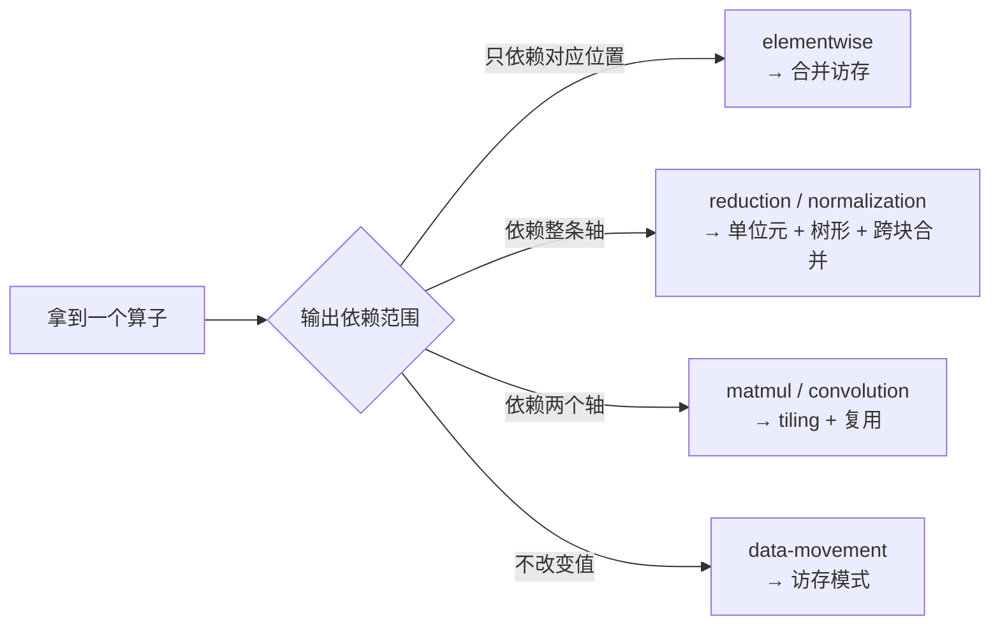

# 算子域

按**算子类型**组织。每个类型一个目录，内部结构统一。

## 怎么用

| 你在做什么 | 读哪个文件 |
|---|---|
| 查某个算子的语义、契约、陷阱 | `README.md` |
| 学推导（手算、数据流、逐段代码） | `walkthrough.md` |
| 看实现 | `impl/`，或共享的 [assets/](../assets/README.md) |
| 走完整交付流程 | `case-study.md`（部分算子有） |

同一个算子，查的人读 README，学的人读 walkthrough，踩坑的人对照 impl。三条路径共用一份内容。

**实现放在哪**：算子特有的 CUDA 源码放在该算子的 `impl/` 下；**跨算子共享**的代码（CPU 教学实验、服务于多个算子的 `.cu`、唯一的 CMake 入口）统一放在 [assets/](../assets/README.md)，按语言而不是按算子组织。因此 attention、convolution、fusion 等目录没有 `impl/`——它们的实验代码在 `assets/cpu/`。

## 目录

| 类型 | 目录 | 包含 | 主要瓶颈 |
|---|---|---|---|
| 逐元素 | [elementwise](elementwise/) | [vector-add](elementwise/vector-add/README.md)、[activation](elementwise/activation/README.md) | 访存带宽 |
| 归约 | [reduction](reduction/README.md) | sum、max、min、两阶段跨块 | 访存 + 同步 |
| 归一化 | [normalization](normalization/) | [softmax](normalization/softmax/README.md)、[layernorm](normalization/layernorm/README.md) | 访存 + 数值稳定 |
| 矩阵乘 | [matmul](matmul/README.md) | GEMM 版本阶梯 v1→v2、[decode 小 M](matmul/decode-gemm.md) | 数据复用 |
| 注意力 | [attention](attention/README.md) | FlashAttention、online softmax、causal | 不物化中间矩阵 |
| 卷积 | [convolution](convolution/README.md) | im2col、直接卷积、groups | 输入获取模式 |
| 融合 | [fusion](fusion/README.md) | 何时值得融合、epilogue | 减少内存往返 |
| 数据搬运 | [data-movement](data-movement/README.md) | transpose、pad、gather/scatter | 访存模式 |

## 类别与优化方向

**类别决定方向**。在 elementwise 上研究数据复用是白费，在 matmul 上只关注合并访存是浪费。先判断类别，再选手段。

## 还没覆盖的类别

以下是算子开发的常见工作，本仓目前**没有内容**：

| 类别 | 典型算子 | 现状 |
|---|---|---|
| shape 类 | cat / split / pad / reshape / permute | 部分在 data-movement |
| loss | cross_entropy / nll / softmax+log 融合 | 未覆盖 |
| 优化器 | fused Adam / SGD / LAMB | 未覆盖 |
| 随机 | dropout / philox / 可复现性 | 未覆盖 |
| 序列 | scan / cumsum / topk / sort | 未覆盖 |
| 视觉 | pooling / upsample / nms / roi_align | 未覆盖 |
| 稀疏 | embedding / gather-scatter / spMM | 未覆盖 |
| 通信 | allreduce / allgather / reduce_scatter | 未覆盖 |

补这些的写法参照现有目录的**内部结构**（README / walkthrough / impl）。

## 相关页面

- [决策树](../99-reference/decision-tree.md)：接到一个新算子怎么下手
- [流程主线](../01-workflow/README.md)：一个算子从需求到交付
- [性能手法](../04-performance/techniques/)：跨算子通用的优化手段
- [常见错误清单](../99-reference/common-pitfalls.md)：按症状查找
