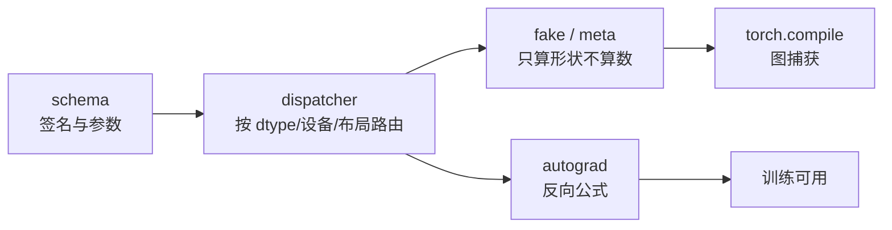

# 框架域

算子写完之后，要能被框架调用、能被自动微分、能被图编译、能被测试。这一域讲这段接口。

## 页面

| 页面 | 回答 |
|---|---|
| [op-lifecycle.md](op-lifecycle.md) | 一个算子接入框架要经过哪些环节：schema、分派、fake/meta、autograd |
| [integration.md](integration.md) | 接口分层与后端适配 |
| [testing.md](testing.md) | 测试矩阵、容差、gradcheck 与 opcheck |
| [impl/custom_bias_relu.py](impl/custom_bias_relu.py) | 可运行的自定义算子注册实验 |

## 一个算子接入框架的四件事

| 环节 | 不做的后果 |
|---|---|
| schema | 无法注册，框架不认识这个算子 |
| dispatcher 注册 | 调用时找不到实现 |
| fake / meta | `torch.compile` 和形状推导失败 |
| autograd | 只能推理，不能训练 |

**顺序很重要**：先有 schema，才能注册实现；先有 fake，才能进图编译。

## 反向公式不是可选项

如果你的算子要参与训练，反向是契约的一部分，不是附加功能。

一个具体的例子（bias + relu 的反向）：

~~~text
前向： Y = relu(X + bias)
反向： dX[b,d]     = G[b,d] * (X[b,d] + bias[d] > 0)
       dBias[d]    = Σ_b dX[b,d]
~~~

注意 `dBias` 是一个**跨 batch 维的归约**——反向里出现了归约，这是常被漏掉的一步。

## 验证：gradcheck 和 opcheck 不是一回事

| 工具 | 检查什么 |
|---|---|
| `gradcheck` | 数值梯度 vs 解析梯度，验证反向公式正确 |
| `opcheck` | schema、fake、autograd 注册是否齐全、是否可被图编译 |

**两个都要跑。** 反向公式对了但没注册 fake，`torch.compile` 会失败；注册齐了但公式错了，训练会静默发散。

## 还没覆盖的

| 主题 | 现状 |
|---|---|
| 库生态：cuBLAS / cuDNN / CUTLASS / oneDNN 何时直接用 | 未写（见 [决策树](../99-reference/decision-tree.md)第一步） |
| PyTorch 之外的框架（Paddle / MindSpore / JAX）接入差异 | 未写 |
| torch.compile 与 CUDA Graph | 部分在 [op-lifecycle.md](op-lifecycle.md) |
| autotuning 与 kernel 选择 | 未写 |

## 相关页面

- [流程主线](../01-workflow/README.md)：接入属于阶段八（验收）之后
- [算子域](../03-operators/README.md)
- [平台域](../06-platforms/README.md)：换后端时的接口一致性
