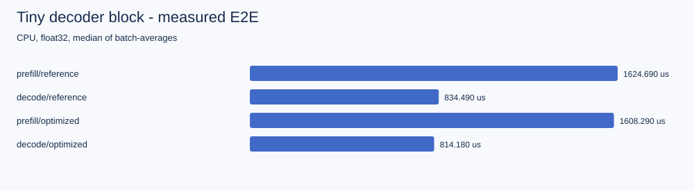
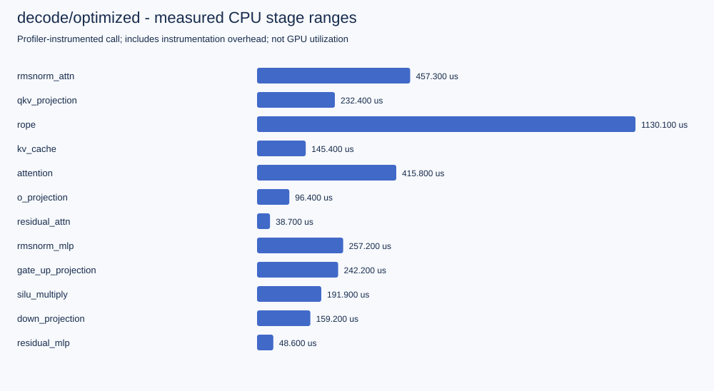

# 完整 Block 的本机 CPU 报告

这是运行 run.py --profile 产生的真实输出，PyTorch 2.8.0+cpu、float32、1 线程，B=1、prefix=64、D=64、heads=4、hidden=128。详细环境、输入形状、源码 SHA256 和原始采样在 [summary.json](summary.json)。Git dirty=true 表示采集时源码尚未提交；源码哈希用于准确对应实现。

## 先检查正确性

reference 与 optimized 的 prefill/decode 均与完整 causal 前向对照通过。另有 test_block.py 的 7 项独立测试覆盖逐 token、mask 和 cache，不用性能结果替代语义验收。

## 不带 profiler 的完整块时间

单位微秒，9 个批次、每批 10 次；中位数和最小/最大值都是批平均时间的统计：

| 工作负载 | reference 中位数 | optimized 中位数 | reference 区间 | optimized 区间 |
|---|---:|---:|---|---|
| prefill | 1624.690 | 1608.290 | 1290.880–2002.580 | 1376.880–1876.810 |
| decode | 834.490 | 814.180 | 736.650–1240.360 | 699.620–1220.040 |

这份采样不能证明候选稳定更快：区间明显重叠，而且候选同时改了 packed projections 与 SDPA。应进行分项实验并扩大测量证据。这里保留不明显的结果，供学生练习如何拒绝过度解释。

计时包含完整 block 的 tensor 运算、输出分配和 cache 拼接，输入/参数已在 CPU；不含权重构造、分词或完整语言模型生成。decode 每次使用固定的 64 token 前缀，不在采样间累积长度。

## 再看 instrumented 阶段分布

optimized decode 的 CPU stage 范围中，RoPE 约 1130.1 us，占所标注范围总和约 33.09%；Attention 约 415.8 us。注意单个 instrumented RoPE 已超过无 profiler 的整块中位数，证明采集开销/单次样本不能忽略。

阶段图用于看这个教学实现的调用组织，不能把这些时间直接代入普通 E2E，也不能据此诊断 GPU HBM 或 SM 效率。查看 [原始 profiler 表](decode-optimized.profiler.txt) 与 [trace](decode-optimized.trace.json)，区分父范围与子事件的 total/self。

## “使用 SDPA”到底走了哪里

prefill-optimized 的原始事件中有 aten::scaled_dot_product_attention 和 aten::_scaled_dot_product_flash_attention_for_cpu。名字中的 for_cpu 明确表明是 CPU 路径，不是 CUDA FlashAttention 的测量。本仓保留 native_events，换设备/版本时可以重新确认分派。

[参考版 prefill trace](prefill-reference.trace.json) 可用于观察显式 matmul/softmax 路径；[候选版 prefill trace](prefill-optimized.trace.json) 可用于观察 SDPA 内部路径。不要只看函数名里出现 flash 就推断硬件实现。

## 内存怎样解释

CPU 运行没有显存峰值，因此 CUDA 字段是 null。代码记录的输出 KV 逻辑体积：prefill 为 2×1×64×64×4=32768 字节，decode 追加后为 33280 字节。它不是 allocator 实际峰值，也不是整个进程 RSS。

在 CUDA 环境重跑会记录 allocator baseline、peak allocated 和增加量；绝对峰值包含当时仍存活的张量，比较时同时查看 baseline。不要用 Python heap 或逻辑字节冒充设备显存测量。

## 复现和练习

~~~powershell
python 06-model-slice/run.py --profile --output 06-model-slice/results/local
~~~

先在自己的报告中找出 input shapes、实际 SDPA 后端和两个残差节点。然后改变一个维度，预测哪个阶段工作量变化，再跑一份新报告。查 [decode GEMM](../../decode-gemm.md) 时，把预测与实际小矩阵/缓存条件联系起来。

## 参考资料

- [PyTorch Profiler](https://docs.pytorch.org/docs/stable/profiler.html)：事件与内存。
- [PyTorch SDPA](https://docs.pytorch.org/docs/stable/generated/torch.nn.functional.scaled_dot_product_attention.html)：后端分派与 mask。
