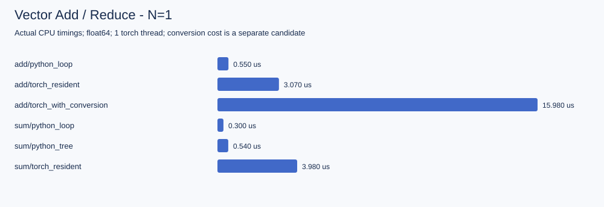
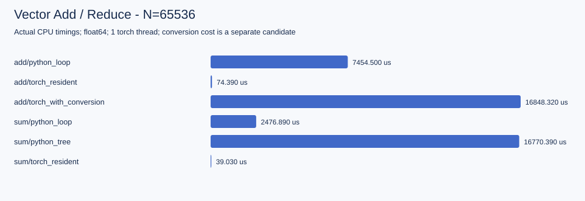

# CPU 基准报告：可检查的证据与阅读顺序

这是本机运行 operator_story.py 得到的真实报告，使用 PyTorch 2.8.0+cpu、float64、1 个 PyTorch 线程。处理器标识、系统、时间、完整构建信息、Git 状态和源码 SHA256 存在 [summary.json](summary.json)。源码当时尚未提交，因此 dirty=true。

**关于哈希的说明**：summary.json 里的 `source_sha256` 是采集当时的记录，路径也写作当时的 `labs/`。仓库后来重排了目录，脚本移到了 `09-practice/operator-stories/`，并改了两处与测量无关的内容（`sys.path` 定位、`--output` 默认值）。因此脚本的哈希与当前文件**不一致**，`course_runtime.py` 仍一致。这里保留原始哈希而不改写它——改写成当前值会让人以为这份数据是当前代码测出来的。

## 先看不带 profiler 的计时

每个候选预热 3 次，9 个采样批次、每批 10 次调用，正反次序交替。表中为批平均值的中位数，单位微秒：

| N | Add Python loop | Add native resident | Sum Python loop | Sum native resident |
|---:|---:|---:|---:|---:|
| 1 | 0.550 | 3.070 | 0.300 | 3.980 |
| 17 | 1.750 | 3.200 | 0.880 | 3.970 |
| 1024 | 92.460 | 6.480 | 36.540 | 8.550 |
| 65536 | 7454.500 | 74.390 | 2476.890 | 39.030 |

这组数据说明本机输入规模会改变后端选择的得失，不能推广成其他设备的固定阈值。Python 使用已有列表，native 使用已有 tensor；另有 torch_with_conversion 候选把输入转换和输出转回列表包含在内，原始样本都在 JSON。

## 然后看 profiler，不要把两份时钟混起来

[原生 profiler 表](native-cpu.profiler.txt) 与 [trace](native-cpu.trace.json) 单独采集 N=65536 的原生 Add/Sum。它实际显示：

- aten::add 一次调用，Self CPU 为 246.500 us，分配 512 KiB；65536×8=524288 字节正好对应输出大小。
- aten::sum 一次调用，CPU total 为 436.500 us，输出分配 8 字节，对应 float64 标量。
- story/vector_add 的 total 包含 aten::add；不能把两者 total 相加当成总耗时。
- story 层的 Self CPU Mem 为负，表示该范围中释放了子调用产生的结果；不是“使用了负内存”。

有 profiler 时的 add 246.5 us 明显不同于无 profiler 的中位数 74.39 us。这里采集事件、shape、内存且调用次数很少，开销不能忽略。因此 trace 用于看结构，普通计时用于比较候选；不是把 profiler 中的任意百分比当成硬件效率。

## 自己的报告“不一样”时怎么查

先检查 N、dtype、线程数、输入是否常驻、是否包含转换、是否使用 profiler，再比较 CPU/软件版本和系统负载。若 native 路径没有 aten::add/aten::sum，确认运行的是哪个版本；若内存大小不一致，先核对 dtype 与 shape。

没有预设“CPU utilization 应为多少”。合理报告应能解释调用链、工作量、输出字节和计时边界。想知道 GPU 事务和 SM 情况，必须另外在 GPU 上采 ncu；此目录不包含 GPU 实测。

## 复现

~~~powershell
python 09-practice/operator-stories/operator_story.py --output 09-practice/operator-stories/results/local
~~~

请保留本目录的基线，用 local 保存自己的输出。跨机器不要要求微秒数逐位一致；对照的是测量方法和解释是否成立。

## 参考资料

- [PyTorch Benchmark](https://docs.pytorch.org/tutorials/recipes/recipes/benchmark.html)：线程、预热和基准方法。
- [PyTorch Profiler](https://docs.pytorch.org/docs/stable/profiler.html)：Self/Total 事件和内存信息。
