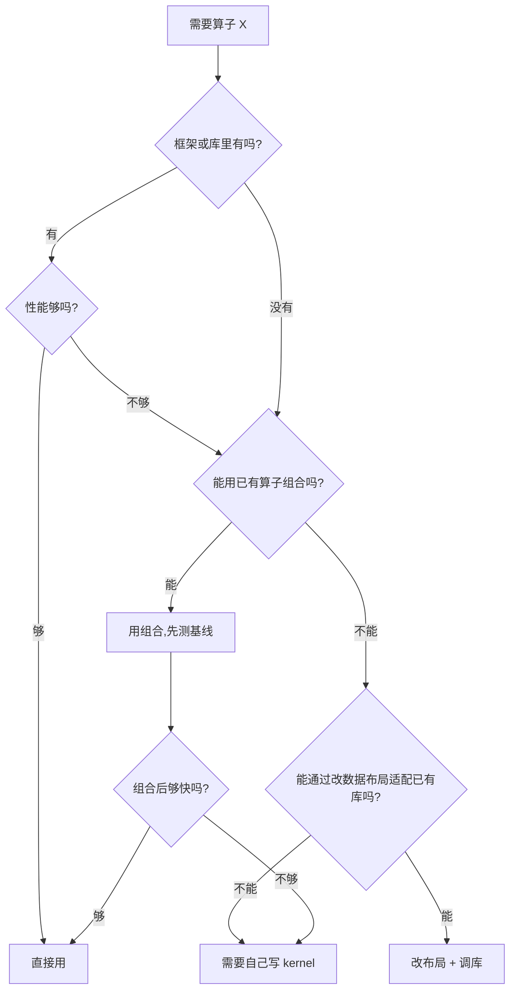

# 决策树：接到一个新算子该怎么做

这是[流程主线](../01-workflow/README.md)的速查版。当你拿到一个“实现某某算子”的任务，按这个顺序问自己。

## 第一步：真的需要自己写吗

**大部分“需要写 kernel”的任务，在前三步就能解决。** 手写 kernel 是最贵的选项，不是第一个选项。

判断依据：

- **框架里有吗**：查 ATen / oneDNN / cuDNN / cuBLAS 的算子列表。
- **能组合吗**：多算子组合会引入额外的内存往返，先测出来是多少再决定。
- **改布局能适配吗**：比如把 NCHW 转成 NHWC 就能用 cuDNN 的高效路径。转换本身有成本，要一起算。

## 第二步：写清契约

进入[阶段一](../01-workflow/01-anatomy.md)。至少要回答：

- 输出 shape 的公式
- 输入输出 dtype 和**累加 dtype**
- 布局要求（连续？对齐？）
- 边界输入逐条的期望值（对照 [边界语义](../02-foundations/contracts/boundary-semantics.md) 的清单）
- 容差和参考值口径
- 确定性：确定还是非确定

## 第三步：判定算子类别

类别决定优化方向。[03-operators](../03-operators/README.md) 按类别组织。

| 特征 | 类别 | 首要注意 |
|---|---|---|
| 输出只依赖对应位置 | elementwise | 合并访存 |
| 沿某维合并 | reduction | 单位元、树形、跨块 |
| 沿某维做统计再归一化 | normalization | 统计合并、数值稳定 |
| 有 M/N/K 三个维度 | matmul | 数据复用、tiling |
| 有 query/key 交互 | attention | 不物化中间矩阵 |
| 有滑动窗口 | convolution | im2col 或直接卷积 |
| 只搬数据不改值 | data-movement | 访存模式 |
| 多个算子可合并 | fusion | 减少内存往返 |

## 第四步：按流程走

从[阶段二](../01-workflow/02-baseline.md)开始，九个阶段逐个走。不要跳。

## 快速对照：症状 → 最可能的原因

| 症状 | 先查 |
|---|---|
| 末项结果为零 | 网格覆盖（[边界](../02-foundations/contracts/boundary-semantics.md)） |
| 全负数时 max 返回 0 | 归约中性值用了 0 |
| 换线程数结果就变 | 统计合并公式（Welford 并行合并） |
| 整除输入正常、非整除失败 | 尾块处理 |
| 结果和框架对不上 | 累加 dtype 不一致 |
| 每次运行结果微不同 | 非确定性（[determinism](../02-foundations/contracts/determinism.md)） |
| 有效带宽只有峰值两成 | 访存不合并 |
| occupancy 高但很慢 | 数据复用不足，或到了带宽上限 |
| 单个 kernel 很快但整体慢 | kernel 之间的空隙、启动开销、中间结果落盘 |
| 优化了但整体没变 | 该阶段占比太小（Amdahl） |

## 什么时候停下来问人

- 契约里有一条你无法确定（比如“全掩码行该返回什么”）——这属于产品决策，不是技术决策。
- 精度要求和参考值口径冲突。
- 目标平台的能力你不确定（某些指令是否可用）。

## 相关页面

- [流程主线](../01-workflow/README.md)
- [常见错误清单](common-pitfalls.md)
- [术语表](glossary.md)
- [算子域](../03-operators/README.md)
